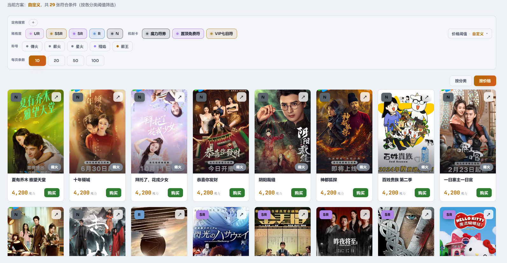
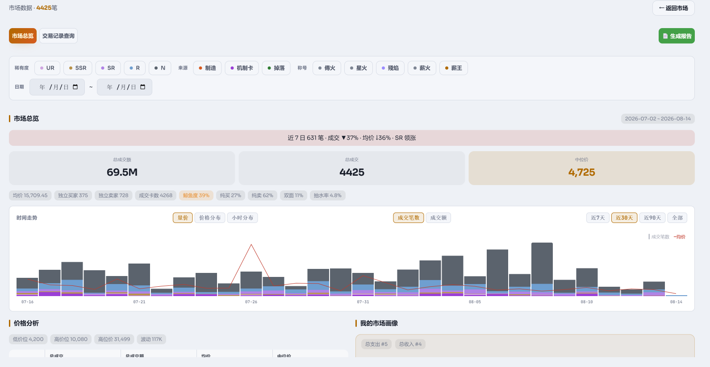
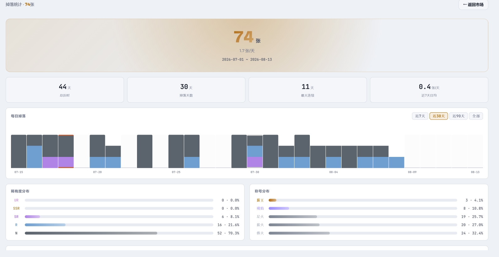

# MCard Server

[](https://hub.docker.com/r/doc2page/mcard)
[](https://hub.docker.com/r/doc2page/mcard/tags)
[](https://github.com/doc2page/mcard/releases)
[](LICENSE)
[](https://nodejs.org)

> M-TEAM card market helper · self-hosted web service (mobile-friendly)

English · [中文](README.md)

A Chrome extension rebuilt as a Dockerized web service for single-user self-hosting. Backend: Node.js + Express + SQLite. Frontend: vanilla JavaScript (no framework). Start with one `docker compose` command; works in both phone and desktop browsers.

## Features

- 💳 **Inventory** — browse owned cards; manually lock cards (locked cards are excluded from trading)
- 📊 **Market** — manually fetch listings, prices, and rarity distribution
- 🛒 **Trading** — buy / sell / cancel orders (with safety gate and budget pool)
- 📈 **Market data** — volume×price / price distribution / hourly trend charts with time-window switch + one-click analysis report
- 📉 **Drop stats** — incremental stats from the feed (official API returns only the latest 25 records; manual import to backfill history)
- 🎟️ **Mana voucher log** — open-card returns / distribution / lucky multiplier
- 🔖 **Order book** — query live listings per card
- 📱 **Mobile-first** — drawer navigation, collapsible stat cards, responsive across phone / tablet / desktop
- 🔑 **API key set via the UI** — stored in backend SQLite, never in the browser
- 🔐 **Optional access auth** — HMAC token login protection (30-day cookie)

## Screenshots

<p align="center">
  <br>
  <b>Market</b> · listings · price · rarity distribution
</p>

<p align="center">
  <br>
  <b>Market data</b> · volume×price / price distribution / trend · one-click report
</p>

<p align="center">
  <br>
  <b>Drop stats</b> · incremental feed + manual import backfill
</p>

<p align="center">
  <br>
  <b>User profile</b> · spend trend (4-tier)
</p>

<p align="center">
  <br>
  <b>Batch operations</b> · bulk buy / sell (safety gate + budget pool)
</p>

## Quick start

The image is published on [Docker Hub](https://hub.docker.com/r/doc2page/mcard) (`doc2page/mcard`). Choose either method:

### ① Pull the image (recommended)

```bash
docker run -d --name mcard -p 31414:31414 -v mcard-data:/app/data \
  -e AUTH_PASSWORD=changeme --restart unless-stopped doc2page/mcard:1.0.1
```

Or `docker-compose.yml`:

```yaml
services:
  mcard:
    image: doc2page/mcard:1.0.1
    container_name: mcard
    ports: ["31414:31414"]
    volumes: ["./data:/app/data"]
    environment:
      AUTH_PASSWORD: "changeme"   # empty = no auth
    restart: unless-stopped
```

### ② Build from source

```bash
git clone https://github.com/doc2page/mcard.git
cd mcard
docker compose up -d --build
```

Open **http://localhost:31414** in a browser. On first visit, enter your M-TEAM API key (it is verified and triggers an initial full refresh).

> 📱 **Mobile**: connect your phone to the same Wi-Fi and open **http://<your-pc-lan-ip>:31414** (e.g. `http://192.168.1.10:31414`).

## Configuration

Everything lives in `docker-compose.yml`:

| Option | Default | Notes |
| --- | --- | --- |
| Port | `31414:31414` | change the left side to remap, e.g. `8080:31414` |
| Volume | `./data:/app/data` | SQLite database (API key + cache); back up the whole `data/` dir |
| Restart | `unless-stopped` | auto-restart on crash; won't restart after manual stop |
| Access password | `AUTH_PASSWORD=""` | empty = no auth; set a password to require login (see "Access auth" below) |
| Timezone | `Asia/Shanghai` | drop-stats day boundary follows this TZ (M-TEAM data is Beijing time). Override via `.env` `TZ=`, e.g. `TZ=UTC` |

Data persists in `./data/mcard.db` — removing the container or rebuilding the image won't lose your API key or cached data.

## Common commands

```bash
docker compose up -d            # start (image pull); for source build use up -d --build
docker compose logs -f          # follow logs
docker compose restart          # restart
docker compose down             # stop and remove container (data kept)
```

## Local development (without Docker)

```bash
npm install
npm start      # listens on 127.0.0.1:31414 by default
```

> `better-sqlite3` is a native module — installing it locally requires `python3` / `make` / `g++` (a build toolchain).

## Notes

- **Build via proxy / run without proxy** (source-build only; image-pull users can skip): `docker-compose.yml` sets `HTTP_PROXY`/`HTTPS_PROXY` in `build.args` (default `http://127.0.0.1:7890`, used only during build for the apt toolchain / npm packages, reachable via `network: host`); the runtime `environment` has no proxy vars, so HTTP requests connect directly to M-TEAM. To change the proxy, edit `build.args`.
- **Manual only**: all data fetching and trading are triggered by clicking in the UI; there is no background polling.
- **Access auth (optional)**: set `AUTH_PASSWORD` in `docker-compose.yml` to enable login protection — all pages / API / SSE require a password (session cookie lasts 30 days); leave empty to disable. **Note**: passwords are sent in plain text over LAN HTTP; for encrypted transport put an HTTPS reverse proxy (Caddy/Nginx) in front.
- **Single-user**: the API key is the only business credential (for M-TEAM), independent from the access password. `HOST=0.0.0.0` listens on all interfaces — deploy on a trusted network (home LAN, Tailscale, etc.).

## Project structure

```
mcard/
├── src/                    # backend (Node + Express + SQLite)
│   ├── server.js           # entry + auth middleware
│   ├── store.js            # SQLite persistence
│   ├── state.js            # in-process state + subscriptions
│   ├── routes/             # REST · SSE · auth
│   └── lib/                # mteam · collector · trader · stats
├── public/                 # frontend (vanilla JS, no framework)
│   ├── index.html
│   ├── app.js / app.css    # main logic + styles
│   ├── dispatch.js         # type → REST mapping
│   ├── marketStats.js      # market analysis + report
│   ├── portrait.js         # user profile
│   └── locales/            # i18n (zh / en)
├── Dockerfile              # Node 20 + better-sqlite3
├── docker-compose.yml      # one-command orchestration
├── LICENSE                 # MIT
└── package.json
```

## License

[MIT](LICENSE) © 2026 doc2page
